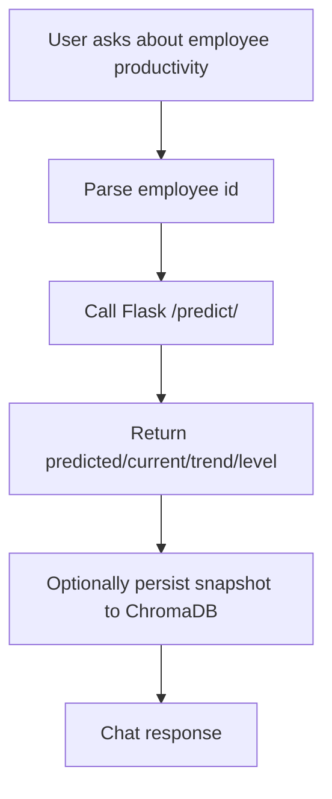

# Chatbot Service · Ollama RAG API

A Retrieval-Augmented Generation chatbot powered by Ollama, FastAPI, and ChromaDB.
It supports general document Q&A plus a productivity workflow that can call the LSTM Flask API, rebuild the productivity vector DB, and answer employee-specific questions with grounded data.

## Features

- Ollama-based generation and embeddings end to end
- FastAPI HTTP API for chat
- Persistent ChromaDB vector storage
- Document ingestion for PDFs, TXT, MD, DOCX, XLSX, CSV, PKL, and KERAS metadata snapshots
- Productivity workflow that can call the Flask LSTM API
- Productivity refresh flow that can rebuild the productivity vector DB from `predict/all`
- Multi-language chat support

## Architecture

### General RAG flow

```mermaid
flowchart TD
  A[User / Client] -->|POST /chat| B[FastAPI]
  B --> C[Detect language / intent]
  C --> D[Ollama embed_query()]
  D --> E[ChromaDB query_by_vector]
  E --> F[Top-K context]
  F --> G[Prompt builder]
  G --> H[Ollama chat generation]
  H --> I[Answer + citations]
  I --> A
```

### Productivity flow

```mermaid
flowchart TD
  A[Admin / Job Trigger] -->|POST /refresh/productivity| B[Flask ML API]
  B --> C[/predict/all]
  C --> D[Clear productivity collection]
  D --> E[Embed snapshot text with Ollama]
  E --> F[Store snapshots in ChromaDB productivity]
  F --> G[Chatbot can retrieve or answer directly]
```

### Specific employee question flow



## Project Structure

```text
chatbot_service/
├─ api/
│  ├─ __init__.py
│  ├─ app.py                 # FastAPI server (/healthz, /chat)
│  └─ schemas.py             # Request/response models
├─ cli/
│  ├─ ingest.py              # Legacy workspace ingest
│  ├─ ingest_workspace.py    # Workspace ingest / productivity refresh helper
│  └─ inspect_chroma.py      # Inspect Chroma collections
├─ src/
│  └─ rag/
│     ├─ __init__.py
│     ├─ config.py           # .env settings
│     ├─ chunking.py         # File loaders + splitters
│     ├─ embeddings/
│     │  └─ ollama.py        # Ollama embeddings
│     ├─ vectorstores/
│     │  └─ chroma_store.py  # Chroma add/query/delete helpers
│     ├─ retrieval.py        # Embed query + retrieve top-k
│     ├─ prompting.py        # Prompt templates
│     ├─ ollama_generate.py  # Ollama chat generation
│     └─ pipeline.py         # Main answer() orchestration
├─ var/
│  └─ chroma_db/             # Persistent Chroma storage
├─ data/
│  └─ raw/                   # Optional document source folder
├─ requirements.txt
└─ README.md
```

## Quickstart

### 1) Create environment

```bash
python -m venv .venv
source .venv/bin/activate
pip install -r requirements.txt
```

### 2) Configure `.env`

Example for Ollama + productivity workflow:

```env
OLLAMA_BASE_URL=http://localhost:11434
MODEL_NAME=llama3.2:latest
EMBED_MODEL=qwen3-embedding:latest
EMBED_DIM=768
CHROMA_DIR=var/chroma_db
COLLECTION=kb_collection
TOP_K=4
PRODUCTIVITY_API_BASE_URL=http://127.0.0.1:5001
ANONYMIZED_TELEMETRY=False
```

Notes:

- `MODEL_NAME` is the Ollama chat model used for generation.
- `EMBED_MODEL` is the Ollama embedding model.
- `PRODUCTIVITY_API_BASE_URL` points to the Flask LSTM service.
- `CHROMA_DIR` should point to the Chroma root used by the chatbot service.

### 3) Run Ollama

Make sure Ollama is running and the models are available locally.

Example:

```bash
ollama serve
ollama pull deepseek-r1:latest
ollama pull qwen3-embedding:latest
```

### 4) Run the FastAPI chatbot service

```bash
uvicorn api.app:app --host 127.0.0.1 --port 8002 --reload
```

Health check:

```bash
curl http://127.0.0.1:8002/health
```

## Workflows

### A. General document Q&A

1. Put documents into a workspace.
2. Ingest them into ChromaDB.
3. Ask a question through `POST /chat`.
4. The system retrieves top-k chunks and answers using Ollama.

### B. Productivity insight for one employee

1. User asks a question like:
    - `give me productivity insight of user_1`
    - `show productivity of employee 12`
2. Chatbot parses the employee id.
3. It calls Flask `GET /predict/<id>`.
4. The response is formatted into a human-readable answer.

### C. Refresh productivity vector DB

This is the workflow for rebuilding the productivity workspace from fresh predictions.

1. Run ETL.
2. Train the LSTM model.
3. Call Flask `POST /predict/all`.
4. Delete the old productivity Chroma collection.
5. Store the new snapshot records into `workspace_id=productivity`.
6. Chatbot uses those snapshots for retrieval.

CLI:

```bash
python3 cli/ingest_workspace.py --refresh-productivity
```

Optional API base URL override:

```bash
cd chatbot_service
python3 cli/ingest_workspace.py --refresh-productivity --api-base-url http://127.0.0.1:5001
```

## API

### `POST /chat`

Request:

```json
{
    "message": "Give me productivity insight of user_1",
    "k": 5,
    "lang": "en",
    "user_id": "1",
    "user_role": "admin",
    "workspace_id": "productivity"
}
```

Response:

```json
{
    "answer": "Productivity insight for employee 1: ...",
    "citations": []
}
```

### `GET /health`

Returns:

```json
{ "status": "ok" }
```

## Productivity Vector DB

The productivity Chroma workspace stores snapshot-style records such as:

- `user_id`
- `employee_name`
- `predicted_productivity`
- `current_productivity`
- `trend`
- `level`
- `confidence`
- `snapshot_date`

These records are used to answer follow-up questions faster and with more context.

## Inspect the Vector DB

Use the Chroma inspect script to view what is inside productivity:

```bash
cd chatbot_service
python3 cli/inspect_chroma.py \
  --db-path var/chroma_db/workspaces/productivity \
  --all \
  --doc-chars 1200

python3 cli/inspect_chroma.py \
  --db-path var/chroma_db/workspaces/public \
  --collection kb_collection \
  --all \
  --doc-chars 1200
```

## Configuration Reference

| Variable                    | Example                  | Notes                          |
| --------------------------- | ------------------------ | ------------------------------ |
| `OLLAMA_BASE_URL`           | `http://localhost:11434` | Ollama server URL              |
| `MODEL_NAME`                | `deepseek-r1:latest`        | Chat generation model          |
| `EMBED_MODEL`               | `qwen3-embedding:latest` | Embedding model                |
| `EMBED_DIM`                 | `768`                    | Must match the embedding model |
| `CHROMA_DIR`                | `var/chroma_db`          | Persistent Chroma root         |
| `COLLECTION`                | `kb_collection`          | Chroma collection name         |
| `TOP_K`                     | `5`                      | Retrieval depth                |
| `PRODUCTIVITY_API_BASE_URL` | `http://127.0.0.1:5001`  | Flask LSTM API base URL        |
| `ANONYMIZED_TELEMETRY`      | `False`                  | Disable Chroma telemetry       |

## Notes

- The chatbot service now uses Ollama for generation and embeddings.
- Gemini-specific files may still exist in the repository, but the active runtime path is Ollama-based.
- If you change embedding model or dimension, rebuild the Chroma DB.
